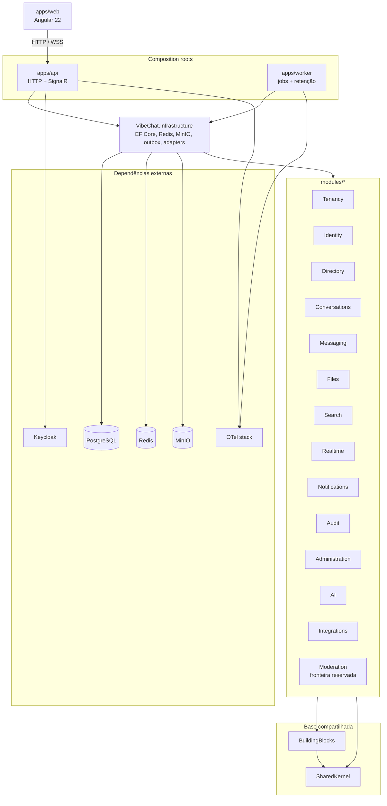

# Diagrama de Módulos — VibeChat

Snapshot das fronteiras existentes em 2026-07-27. O diagrama mostra dependência
de composição, não autoriza módulos de domínio a conhecer internals uns dos
outros.

## Mapa de runtime e composição



`apps/api` também referencia diretamente os módulos necessários para expor
tipos/contratos no composition root. `apps/worker` referencia Infrastructure,
Messaging, Realtime e BuildingBlocks. A lista exata é verificável nos
`*.csproj`.

## Responsabilidades

| Fronteira | Responsabilidade |
|----------|------------------|
| Tenancy | TenantContext e escopo do tenant |
| Identity | Perfis/claims espelhados do IdP |
| Directory | Workspaces, spaces, memberships e papéis |
| Conversations | Channels, DMs, threads e conversations |
| Messaging | Messages, reactions, `seq`, idempotência e eventos |
| Files | Attachments e políticas de arquivo |
| Search | Contratos e modelos da busca FTS |
| Realtime | Hub, presence, typing e publicação |
| Notifications | Preferências e e-mail |
| Audit | Registro de ações sensíveis |
| Administration | Dashboard, settings, export e auditoria de conversas |
| AI | Portas, settings e uso das features de IA |
| Integrations | Webhooks outbound; futura trilha de plugins autorizada |
| Moderation | Assembly reservado, ainda sem domínio material |
| BuildingBlocks | Outbox e tipos técnicos compartilhados |
| SharedKernel | Identificadores, clock e primitivas mínimas |
| Infrastructure | Persistência e adapters concretos; não é domínio |

## Regras de dependência

1. Módulos de domínio podem depender de `BuildingBlocks` e `SharedKernel`.
2. Módulos de domínio não dependem de `VibeChat.Infrastructure` nem `apps/api`.
3. Um módulo não referencia internals de outro módulo; colaboração ocorre por
   contratos estreitos e eventos.
4. `apps/api` e `apps/worker` são os composition roots.
5. Infraestrutura implementa portas e compõe persistência/adapters, sem mover
   regra de negócio para o composition root.
6. Mutação durável de mensagem publica por outbox; SignalR direto não substitui
   o evento durável.

## Estrutura real

```text
apps/
  api/
  worker/
  web/
modules/
  Administration/ AI/ Audit/ BuildingBlocks/ Conversations/
  Directory/ Files/ Identity/ Integrations/ Messaging/ Moderation/
  Notifications/ Realtime/ Search/ Tenancy/
src/
  VibeChat.Infrastructure/
  VibeChat.SharedKernel/
tests/
  architecture/ integration/ security/ unit/ e2e/ load/
```

## Testes de arquitetura atuais e evolução

`tests/architecture/ArchitectureRulesTests.cs` verifica hoje:

- Messaging não depende de internals de Administration;
- módulos centrais não dependem de Infrastructure/API;
- o catálogo RLS cobre as tabelas tenant-scoped conhecidas.

Gap documental/técnico conhecido: a primeira regra de dependência ainda não é
uma varredura completa de todos os assemblies. Ao adicionar módulo ou referência,
expandir o teste de catálogo para impedir erosão silenciosa das fronteiras.
