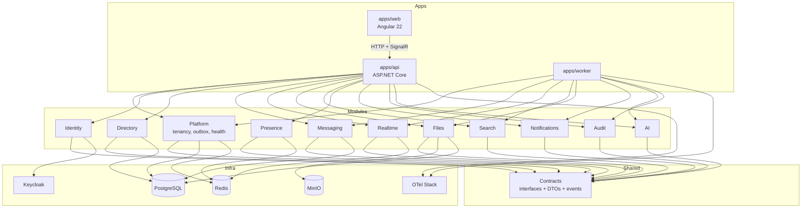

# Diagrama de Módulos — VibeChat

## Mapa de módulos e dependências permitidas



## Regras de dependência

1. Módulos de domínio dependem apenas de **Contracts** + **Platform** (infraestrutura compartilhada).
2. Um módulo **não** referencia o namespace interno de outro módulo.
3. Comunicação entre módulos:
   - **Síncrona:** interfaces em Contracts (ex.: `IMembershipQuery`)
   - **Assíncrona:** eventos de outbox (`MessageCreated`, `MembershipChanged`)
4. `apps/api` e `apps/worker` são composition roots — registram implementações.
5. `AI` é opcional: se desabilitado, binding é `NoOpAiAssistant`.

## Pacotes sugeridos (solução .NET)

```
src/
  VibeChat.Contracts/
  VibeChat.Platform/
  VibeChat.Modules.Identity/
  VibeChat.Modules.Directory/
  VibeChat.Modules.Messaging/
  VibeChat.Modules.Realtime/
  VibeChat.Modules.Files/
  VibeChat.Modules.Search/
  VibeChat.Modules.Presence/
  VibeChat.Modules.Notifications/
  VibeChat.Modules.Audit/
  VibeChat.Modules.AI/
apps/
  VibeChat.Api/
  VibeChat.Worker/
  VibeChat.Web/          # Angular (repo apps/web)
```

## Testes de arquitetura

Usar testes NetArchTest / similares em `tests/architecture` para garantir:

- Modules.* não referenciam outros Modules.* diretamente
- Apenas Api/Worker referenciam todos os módulos
- Contracts não depende de Modules nem de Infra concreta
