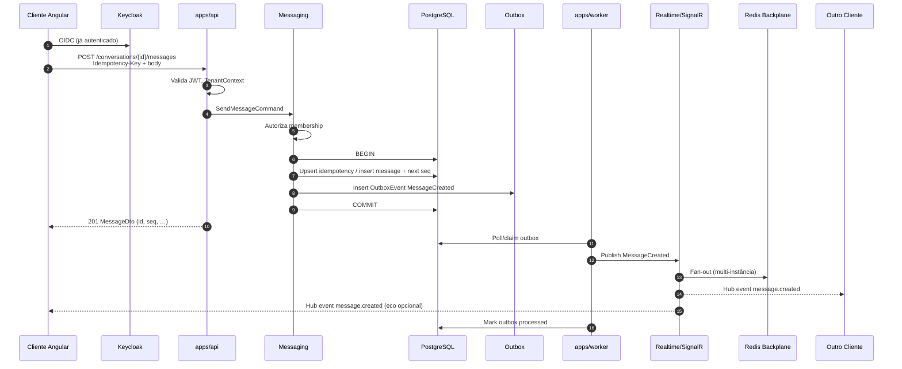
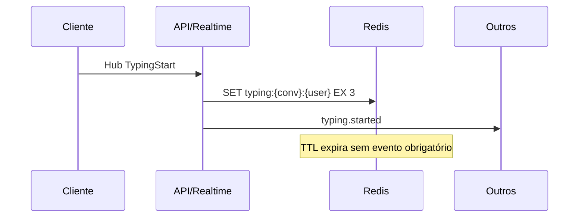

# Fluxo de Envio de Mensagem — VibeChat

## Sequência (caminho feliz)

## Detalhes de consistência

### Transação única

Na mesma transação PostgreSQL:

1. Reservar/atribuir `seq`
2. Inserir `message`
3. Inserir `outbox_event`
4. Registrar chave de idempotência

Se o commit falhar, o cliente pode retentar com a mesma key.

### Idempotência

| Cenário | Comportamento |
|---------|---------------|
| Mesma key, mesmo payload | Retorna mensagem existente (200/201 idempotente) |
| Mesma key, payload diferente | 409 Conflict |
| Sem key | Aceito apenas se política permitir; preferir exigir key no cliente |

### Ordenação

- `seq` é a ordem canônica por conversation
- Clientes mantêm `last_seq`; se `incoming.seq > last+1`, buscam history gap-fill
- SignalR é best-effort de entrega em tempo real; history API é a reconciliação

### Falha do worker

- Outbox permanece `processed_at IS NULL`
- Retry com backoff + dead-letter após N tentativas
- Mensagem já está persistida — usuário que deu refresh vê o histórico mesmo antes do fan-out

## Fluxo de presença / typing (paralelo)

## Anexos (fase posterior à fatia mínima)

1. Cliente solicita URL pré-assinada (Files)
2. Upload direto ao MinIO
3. Cliente confirma attachment no envio da mensagem (ou mensagem com refs)
4. Worker pode gerar thumbnail / scan (jobs)

## Correlação e observabilidade

- `traceparent` propagado HTTP → handler → outbox payload → worker → hub
- Spans: `messaging.send`, `outbox.write`, `outbox.process`, `realtime.publish`
- Métricas: `messages_sent_total`, `outbox_lag_seconds`, `signalr_fanout_duration`
