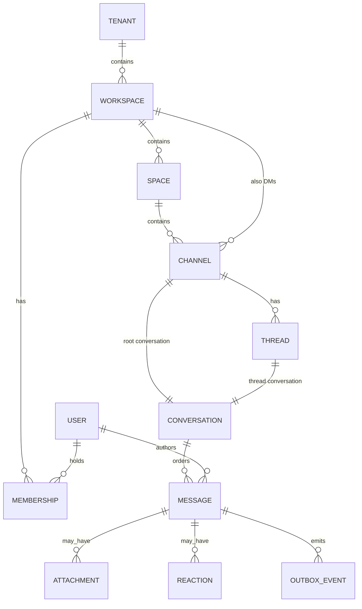

# Modelo de Domínio — VibeChat

## Visão conceitual

## Agregados principais

### Tenant

- **Root:** `Tenant`
- **Attrs:** `id`, `slug`, `name`, `status`, `settings`
- **Invariantes:** slug único; dados de negócio sempre referenciam `tenant_id`

### Workspace

- **Root:** `Workspace`
- **Attrs:** `id`, `tenant_id`, `name`, `slug`, `status`
- **Filhos:** Memberships, Spaces, Channels (incl. DMs do workspace)

### Space

- **Root:** `Space`
- **Attrs:** `id`, `tenant_id`, `workspace_id`, `name`, `order`
- Agrupa channels; não é canal de mensagens

### Channel

- **Root:** `Channel`
- **Attrs:** `id`, `tenant_id`, `workspace_id`, `space_id?`, `type` (public|private|dm), `name`, `topic?`
- Possui uma **Conversation** raiz (`kind = channel`)

### Thread

- **Root:** `Thread`
- **Attrs:** `id`, `tenant_id`, `channel_id`, `parent_message_id`
- Possui **Conversation** própria (`kind = thread`)

### Conversation

Abstração técnica de ordenação e entrega:

| Campo | Descrição |
|-------|-----------|
| `id` | UUID |
| `tenant_id` | Isolamento |
| `kind` | `channel` \| `thread` |
| `channel_id` | Canal pai |
| `thread_id?` | Se kind=thread |
| `next_seq` | Próximo número a atribuir (ou tabela de counters) |

### Message

- **Root:** `Message`
- **Attrs:** `id`, `tenant_id`, `conversation_id`, `seq`, `author_user_id`, `body`, `content_type`, `created_at`, `edited_at?`, `deleted_at?`, `idempotency_key`
- **Invariantes:**
  - `(tenant_id, conversation_id, seq)` único
  - `(tenant_id, conversation_id, idempotency_key)` único quando key presente
  - `seq` estritamente crescente por conversation

### OutboxEvent

- **Attrs:** `id`, `tenant_id`, `aggregate_type`, `aggregate_id`, `event_type`, `payload`, `occurred_at`, `processed_at?`, `attempts`
- Gravado na mesma transação do aggregate

### Attachment

- Metadados no Postgres; objeto no MinIO
- `storage_key`, `content_type`, `size`, `checksum`, `message_id`

### Membership / Role

- Escopos: workspace, space (opcional), channel
- Roles: `owner`, `admin`, `member`, `guest` (extensível)

## Bounded contexts (mapeamento)

| Contexto | Agregados / modelos |
|----------|---------------------|
| Tenancy | TenantContext e escopo de tenant |
| Directory | Workspace, Space, Membership |
| Conversations | Channel, ChannelMember, Thread, Conversation |
| Messaging | Message, Reaction, ReadCursor, Idempotency |
| Files | Attachment |
| Identity | User (projeção/espelho), claims de sessão |
| Audit | AuditEvent |
| Administration | Settings e projeções administrativas |
| AI | Settings e UsageRecord |
| Notifications | Preferences e EmailSettings |
| Integrations | WebhookEndpoint |
| BuildingBlocks | OutboxMessage |

## Regras transversais

1. **TenantContext obrigatório** em todo handler de negócio
2. **Autorização por membership** antes de mutar conversation
3. **Edições/exclusões** geram novos eventos; soft-delete preferido na fase 1
4. **Topics** são metadados de organização, não agregados de mensagens
5. **AI** não possui aggregate próprio de chat; opera sobre projeções autorizadas

## Identificadores

- UUIDv7 (preferencial) ou UUID ordenável para entidades novas
- IDs opacos na API pública
- Nunca expor sequências internas de banco como IDs públicos além do `seq` de conversation (este é intencional e por conversa)
