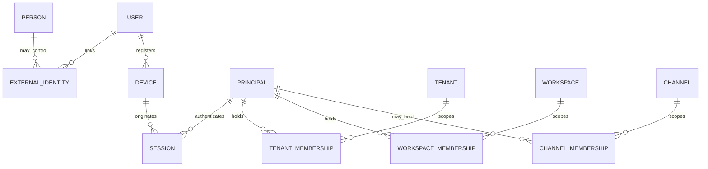

# Modelo Canônico de Identidade e Principals

Contrato conceitual para impedir que autenticação, pessoa, perfil, membership,
dispositivo e identidades técnicas virem sinônimos. Complementa
[`modelo-dominio.md`](modelo-dominio.md), ADR-007 e o glossário.

## Invariante central

**Keycloak autentica uma identidade; VibeChat autoriza um principal por meio de
memberships, capabilities e políticas próprias.**

Login válido nunca cria acesso implícito a tenant, workspace, canal ou função
administrativa.

## Conceitos

| Conceito | Responsabilidade | Fonte canônica |
|----------|------------------|----------------|
| Person | Pessoa natural, quando conhecida; não é credencial | Diretório organizacional futuro |
| ExternalIdentity | Vínculo `(issuer, subject)` autenticado por OIDC/SCIM | IdP + espelho VibeChat |
| User | Perfil local estável usado como ator humano | VibeChat Identity |
| Principal | Abstração autorizável: User, Guest, Bot, ServiceAccount ou Automation | VibeChat |
| TenantMembership | Vínculo administrativo com o limite jurídico/isolamento | VibeChat |
| WorkspaceMembership | Papel e participação dentro do workspace | VibeChat Directory |
| ChannelMembership | Grant explícito para canal privado, DM ou guest | VibeChat Conversations |
| Device | Instalação registrada de um cliente | VibeChat Identity |
| Session | Sessão autenticada, revogável, associada a principal e dispositivo | IdP + VibeChat |
| ServiceAccount | Principal técnico para integração administrativa controlada | VibeChat |
| Bot | Principal técnico de plugin, visível nas conversas | VibeChat Integrations |
| Guest | Principal humano com membership restrita e expiração | VibeChat Directory |
| Automation | Principal efêmero/lógico para uma execução de workflow | VibeChat Automation |

`Principal` é um conceito de autorização; não exige uma única tabela física.

## Relações



## Pessoa, identidade e usuário

- Uma pessoa pode possuir mais de uma identidade externa.
- `(issuer, subject)` é único; e-mail não é identificador imutável.
- Vincular duas identidades ao mesmo User exige fluxo verificável e auditado.
- Troca de e-mail não cria novo User nem transfere membership.
- Merge/split de perfis é operação administrativa sensível, nunca heurística
  automática.
- Perfil `pending:{email}` é convite pendente, não identidade autenticada.

## Memberships

### Tenant

Define vínculo com o limite jurídico e operacional. Não substitui membership de
workspace.

### Workspace

Define participação e papel local. Um principal pode ter papéis diferentes em
workspaces do mesmo tenant.

### Channel

Necessária para canais privados, DMs e guests. Canal público ainda exige
membership válida no workspace.

Toda membership possui:

- `tenant_id`;
- principal e escopo;
- estado `Pending | Active | Suspended | Revoked | Expired`;
- origem (`invite`, `scim`, `admin`, `migration`, `plugin`);
- timestamps e ator da mudança;
- expiração opcional;
- versão para concorrência.

Revogação prevalece imediatamente sobre cache, token ainda válido e posse de
chave local. Propagação para clientes e integrações é observada por SLO.

## Principals humanos

| Tipo | Autenticação | Regra |
|------|--------------|-------|
| Member | OIDC | Acesso somente pelas memberships |
| Guest | OIDC | Um canal por convite inicial; expiração e revogação |
| Moderator/Admin/Auditor | OIDC | Papel não elimina checks de tenant e escopo |
| Platform operator | Fora do membership comum | Break-glass separado e auditado |

Papel é atributo da relação com o escopo, não propriedade global do User.

## Principals técnicos

| Tipo | Uso | Limite |
|------|-----|--------|
| ServiceAccount | Provisioning ou operação machine-to-machine | Capabilities explícitas; sem login UI |
| Bot | Produzir/interagir em conversa | Identidade visível; grants por canal |
| Plugin | Owner lógico de credenciais/capabilities | Não herda papel do instalador |
| Automation | Executar uma versão de workflow | Interseção entre owner, definition e trigger |

Toda ação técnica registra:

- principal efetivo;
- principal que configurou/delegou;
- tenant/workspace;
- capabilities efetivas;
- origem da execução;
- correlation/causation id.

Nenhuma cadeia delegada pode ampliar privilégios.

## Dispositivo e sessão

Device é necessário para offline, push, E2EE e remote logout. Campos conceituais:

- ID opaco;
- principal;
- tipo/plataforma e versão do cliente;
- chave pública quando aplicável;
- push subscription separada;
- data de registro/último uso;
- trust/verification state;
- revogação.

Session:

- referencia principal e, quando disponível, device;
- possui issuer, subject, issued/expiry e session id;
- pode ser revogada sem apagar o User;
- nunca carrega autorização definitiva sem revalidação de membership;
- não é armazenada em log com token/cookie.

## Provisioning

Porta canônica futura:

```text
Provisioning adapter
  → comando VibeChat de User/Group/Membership
  → validação de mapping e policy
  → persistência tenant-scoped
  → audit + revogação de sessões
```

SCIM, Keycloak e importadores são adapters. Nenhum deles escreve diretamente nas
tabelas internas de membership.

## Desativação e exclusão

- Desativar identidade externa impede novo login.
- Suspender User revoga sessões e acesso, mas preserva autoria histórica.
- Remover membership não apaga conteúdo autorado.
- Purge de dados pessoais segue retenção/legal hold.
- Guest expirado e service account revogada não permanecem em grupos realtime,
  caches ou índices de autorização.
- Reativação é explícita e auditada; não restaura grants expirados por acidente.

## AuthZ

Decisão efetiva:

```text
principal autenticado
  ∩ tenant ativo
  ∩ membership ativa
  ∩ papel/capability
  ∩ escopo do recurso
  ∩ policy/feature flag
  ∩ estado atual de revogação
```

UI pode esconder ação, mas API e worker repetem a decisão. Snapshot histórico de
autorização explica uma ação passada; nunca concede acesso atual.

## Testes obrigatórios

- mesmo `sub` em issuers diferentes não colide;
- e-mail alterado não transfere membership;
- login sem membership não acessa workspace;
- guest expirado/revogado perde API, hub, busca, push e download;
- bot/plugin não herda papel do instalador;
- deprovision revoga sessões e caches;
- troca de conta/dispositivo não mistura estado local;
- principal de tenant A não referencia escopo de B;
- replay de token revogado falha fechado.

## Evolução

Mudança na semântica de Principal, User ou Membership exige:

- atualização do glossário e modelo de domínio;
- migration e plano de compatibilidade;
- threat model;
- testes cross-tenant;
- ADR quando mudar fronteira entre IdP e VibeChat.
