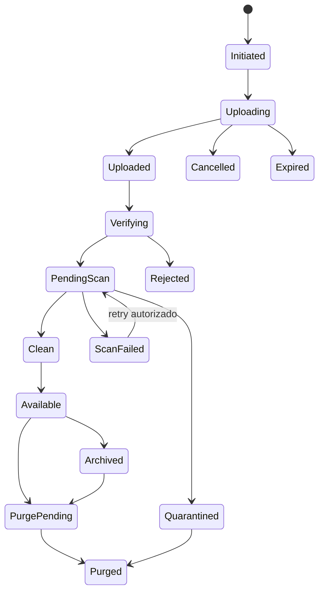

# Pipeline Canônico de Anexos

State machine única para uploads, previews, malware scanning, lifecycle e futuras
variantes E2EE. Consolida contratos hoje distribuídos entre B-025, B-079, B-090,
B-131 e B-145.

## Estados

Antes de B-131, `PendingScan → Clean` pode ser realizado pelo adapter nulo
explicitamente configurado. Nunca tratar ausência acidental de scanner como
resultado Clean em perfil que exige scanning.

## Invariantes

- Metadata fica no PostgreSQL; bytes no storage S3-compatible.
- Object key é opaca e namespaced por tenant.
- URL assinada tem TTL curto e nunca substitui authZ.
- `complete` valida o objeto real, não confia no request inicial.
- Mensagem só referencia attachment em estado permitido.
- Quarentena não é publicamente baixável.
- Checksum e tamanho são verificados server-side.
- Content type declarado é hint; tipo efetivo vem de sniffing seguro.
- Lifecycle respeita legal hold.

## Iniciação

Request informa:

- channel/conversation;
- nome original;
- tamanho declarado;
- content type declarado;
- checksum quando disponível;
- upload mode/capabilities.

Servidor:

1. valida membership e `file.upload`;
2. valida quotas de arquivo, mensagem, usuário e tenant;
3. normaliza nome para apresentação, sem usar como key;
4. reserva quota;
5. cria ID/key opacos;
6. retorna URL/partes com expiração.

## Upload

- PUT simples para arquivos pequenos.
- Multipart/resumable é permitido quando B-079/B-145 definir threshold.
- Cada parte possui checksum quando suportado.
- Cancel libera reserva e agenda limpeza.
- Expiração fecha sessão incompleta.
- Retry não cria novo attachment para a mesma intenção.

## Verificação

No `complete`:

- objeto existe na key esperada;
- tamanho real está dentro do limite;
- checksum coincide;
- número de partes/ETag é consistente;
- MIME sniffing usa allowlist;
- extensão não concede confiança;
- arquivo compactado segue limites de profundidade, razão e bytes expandidos;
- imagem/documento malformado falha fechado;
- metadata sensível é removida somente por policy explícita e auditada.

Falha move para `Rejected` e agenda remoção.

## Malware e quarentena

- Bytes são fornecidos ao scanner sem metadata desnecessária.
- Scanner roda isolado, com timeout e limite de recursos.
- Resultado inclui engine/signature version e timestamp.
- `PendingScan`, `Quarantined` e `ScanFailed` não baixam no default seguro.
- Release manual exige capability segregada, justificativa e audit.
- Re-scan é idempotente.
- EICAR é permitido somente em ambiente de teste isolado.

## Preview e transformação

Jobs derivados:

- thumbnail (B-090): WebP lado maior 640 px; image/* + 1ª página PDF;
  `ThumbnailStatus` Pending→Ready|Failed; disparado por `files.attachment.ready`;
- preview seguro;
- waveform;
- metadata de mídia;
- transcoding futuro.

Cada derivado:

- referencia origem e versão/checksum;
- possui key própria no mesmo tenant;
- usa sandbox/limites de memória e dimensão;
- nunca executa macro/script;
- herda ACL, retention e hold;
- pode ser descartado/reconstruído.

## Disponibilidade e download

Download:

1. revalida principal, tenant, membership e estado;
2. aplica DLP/classificação quando existir;
3. gera URL curta para objeto exato;
4. força nome/content disposition seguros;
5. audita quando policy exigir.

CDN somente recebe objetos `Clean`, por URL assinada e sem bucket público.

## Limites e quotas

| Limite | Escopo |
|--------|--------|
| Bytes por arquivo | Instância/policy |
| Arquivos por mensagem | Produto |
| Bytes por mensagem | Produto/policy |
| Uploads simultâneos | Principal/tenant |
| Storage reservado/usado | Tenant/workspace |
| Razão de descompressão | Scanner |
| Dimensões/pixels | Preview |
| Tempo de upload | Sessão |

Reserva concorrente impede ultrapassar hard quota. Reconciliação corrige ledger.

## Órfãos

Órfão inclui:

- sessão iniciada nunca concluída;
- objeto sem metadata;
- metadata sem objeto;
- derivado de origem removida;
- multipart abandonado.

GC usa mark-and-sweep, dry-run, grace period e tenant partition. Nunca remove
objeto referenciado ou held. Resultado é auditável e reconciliável.

## E2EE

- Cliente cifra antes do upload.
- Servidor vê ciphertext, tamanho aproximado e metadata mínima.
- Scanner/preview server-side ficam indisponíveis salvo desenho criptográfico
  futuro explícito.
- Checksum de ciphertext não autentica plaintext para o servidor.
- Nome/MIME sensível pode ser cifrado conforme protocolo.
- Chave nunca entra em metadata, log, outbox ou URL.

## Eventos

- `attachment.upload.initiated`;
- `attachment.upload.completed`;
- `attachment.verification.failed`;
- `attachment.scan.requested`;
- `attachment.scan.completed`;
- `attachment.available`;
- `attachment.quarantined`;
- `attachment.purged`.

Eventos são versionados, idempotentes e carregam apenas IDs/estado necessários.

## Observabilidade

- upload success/latency;
- bytes/reservas;
- verification rejection;
- scan queue/latency/failure;
- quarantine count;
- preview failure;
- orphan bytes;
- GC candidates/deleted;
- download denied;
- purge lag.

## Testes

- tamanho/checksum divergente;
- MIME spoofing;
- zip bomb e arquivo malformado;
- multipart cancel/retry;
- objeto/key cross-tenant;
- URL expirada/replay;
- scanner timeout/failure;
- quarantine/release;
- preview com limite;
- quota concorrente;
- GC versus referência/hold;
- E2EE sem vazamento de key/plaintext.
