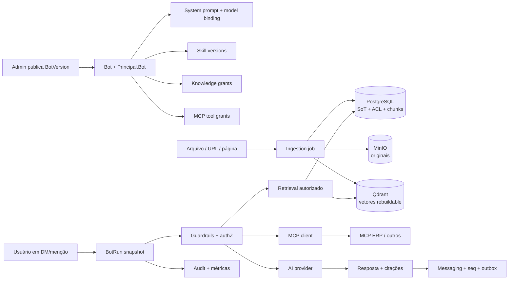

# Plataforma de Bots Internos com IA

Contrato arquitetural pré-implementação da Wave 18. Este documento descreve o
resultado autorizado e suas invariantes; não afirma que bots, Qdrant ou MCP já
existem no runtime.

## Objetivo

Permitir que cada workspace publique vários bots internos, cada um com:

- personalidade definida por system prompt versionado;
- provider/modelo e parâmetros governados;
- skills declarativas e reutilizáveis;
- conhecimento privado vindo de arquivos, páginas ou URLs;
- servidores e tools MCP explicitamente concedidos;
- auditoria, orçamento, guardrails e avaliação antes de produção.

Exemplos:

| Bot | Conhecimento | Tools | Default |
|-----|--------------|-------|---------|
| **Oráculo da empresa** | políticas, manuais e páginas internas | nenhuma | responde apenas com fontes autorizadas |
| **Assistente de ERP** | instruções operacionais mínimas | MCP do ERP com scopes allowlisted | leitura por default; escrita exige aprovação |
| **Treinador** | material curado do programa de treinamento | nenhuma ou tools específicas | não acessa dados corporativos não concedidos |
| **Assistente geral** | nenhum corpus privado | nenhuma | modelo geral, sem inventar acesso interno |

Nome e personalidade não concedem capacidade. Um “oráculo” sem fonte autorizada
continua sem acesso; um bot de ERP sem grant de tool continua sem chamar o ERP.

## Decisões vigentes

- D-16: plataforma aberta de comunicação, conhecimento e automação.
- D-18: integração é configuração + serviço externo; não executa DLL/JS de
  terceiro dentro da API/Worker/browser.
- D-22: IA provider-neutral, externa opt-in, com ACL, retenção, citações,
  orçamento e audit.
- ADR-012: IA opcional e fora do hot path de `SendMessage`.
- ADR-019: Qdrant é projeção vetorial reconstruível; PostgreSQL permanece SoT.

## Fronteiras

| Fronteira | Responsabilidade na Wave 18 |
|----------|------------------------------|
| **AI** | BotDefinition, versões publicadas, system prompt, model binding, skills, runs, policy/orchestration e portas de provider/embedding/vector |
| **Integrations** | MCP server registrations, auth references, tool catalog, grants, approvals e egress |
| **Files** | Upload, scan e lifecycle das fontes em arquivo |
| **Knowledge/Search** | Fontes/páginas/chunks, provenance, ACL e recuperação autorizada |
| **Audit** | Eventos de configuração, execução, retrieval, tool e aprovação |
| **Administration** | Builder, publicação, políticas, custos e investigação |
| **Messaging/Realtime** | Invocação por DM/menção e entrega da resposta pelo pipeline existente |
| **Worker** | Ingestão, embeddings, execução assíncrona, rebuild, timeout e compensação |

Não criar um microserviço “Agent”. API e Worker continuam composition roots do
monólito modular; Qdrant e MCP são dependências externas atrás de portas.

## Modelo conceitual



## Identidade e autoridade efetiva

Cada bot publicado possui uma identidade `Principal.Bot` visível nas conversas,
reutilizando B-109. A definição do bot e a credencial de integração são
conceitos separados: desativar o bot revoga novos runs, mas preserva autoria e
audit históricos.

Em execução interativa, a autoridade é a interseção:

```text
usuário solicitante atual
  ∩ membership/ACL atual
  ∩ grants publicados do bot
  ∩ grants do servidor/tool MCP
  ∩ classificação e policy do workspace
  ∩ feature flags, orçamento e estado de revogação
```

O bot nunca herda `workspace.admin`, credenciais ou grants de quem o cadastrou.
Uma resposta pode usar somente fontes que o solicitante e o bot podem acessar.
Uma tool pode executar somente com grant explícito e credencial destinada
àquele servidor.

Run agendado ou automatizado troca “usuário solicitante” pela identidade
`Automation`/owner e continua usando a mesma interseção; snapshot histórico não
concede acesso atual.

## Configuração e versionamento

### Bot

`BotDefinition` mantém identidade, owner, estado e rascunho. `BotVersion`
publicada é imutável e contém referências exatas para:

- `system_prompt_version`;
- `model_binding`;
- `skill_version_ids`;
- `knowledge_grant_ids`;
- `mcp_tool_grant_ids`;
- `guardrail_policy_version`;
- limites de orçamento, turnos, contexto e duração;
- canais/DMs em que pode ser invocado.

Todo `BotRun` fixa uma versão publicada. Edição posterior não altera execução em
curso nem investigação histórica. Rollback republica versão anterior; não
reescreve audit.

### Model binding

O binding registra alias de provider, model id, classe de dados permitida,
parâmetros allowlisted, limite de tokens, timeout, fallback e budget. O modelo
efetivamente resolvido entra no audit. Chave de provider nunca pertence ao bot e
continua em env/secret store.

Provider/model indisponível produz estado explícito; fallback só ocorre para
modelo permitido pela mesma classificação/policy, nunca para provider externo
mais permissivo.

## Composição segura de prompt

Ordem de precedência:

1. invariantes da plataforma e policy obrigatória;
2. policy do tenant/workspace;
3. system prompt da versão publicada do bot;
4. instruções das skills, em ordem explícita;
5. fontes RAG recuperadas;
6. schemas/resultados de tools MCP;
7. contexto de conversa e pedido do usuário.

Conteúdo de arquivos, páginas, URLs, mensagens e tools é **dado não confiável**.
Nunca é promovido a system prompt, mesmo que contenha texto como “ignore as
instruções anteriores”. Skills não podem remover guardrails nem adicionar
capability.

O runtime registra hashes/versões, não prompts, documentos ou respostas
completas em logs operacionais. Acesso administrativo ao conteúdo configurado
segue policy própria e audit.

## Skills personalizadas

Skill é um pacote declarativo, versionado e tenant-scoped:

- nome, descrição e instruções;
- schema de argumentos opcional;
- exemplos/testes sem secrets;
- referências a knowledge scopes e tools já concedidas;
- compatibilidade e owner;
- estado `Draft | Published | Deprecated`.

Skill não executa código arbitrário, não carrega biblioteca e não contém
credencial. Efeito externo só ocorre por tool MCP/plugin allowlisted, passando
pela autorização e pelos guardrails. Conteúdo da skill é tratado como
configuração sensível e sujeito a diff/audit/publicação.

## Conhecimento, arquivos, URLs e Qdrant

### Fonte canônica

`KnowledgeSource` registra tipo, URI/arquivo, owner, classificação, ACL, hash,
versão, status de ingestão, retention e política de atualização. Arquivo usa o
pipeline de Files/scan; URL usa fetcher com defesa SSRF, limites de redirect,
DNS/IP revalidation, tipo/tamanho, allowlist e profundidade zero por default.

Uma URL cadastrada representa um snapshot versionado. Crawl de site inteiro,
login interativo e browser arbitrário não entram na primeira fatia.

### Pipeline

```text
source accepted
  → fetch/scan/parse
  → normalize + classify
  → chunk versionado no PostgreSQL
  → embedding provider permitido
  → upsert idempotente no Qdrant
  → ready com contagem/checksum
```

Falha parcial permanece visível e retryable. Uma fonte não fica `Ready` se
chunks obrigatórios não foram indexados. Rebuild usa checkpoint, versão do
projector e comparação de contagem/checksum.

Retrieval filtra tenant/workspace/bot/classificação no Qdrant, busca os chunks
por ID no PostgreSQL e revalida ACL atual. Citações apontam para fonte e versão
originais. “Sem evidência suficiente” é uma resposta válida e preferível a
completar com conhecimento não autorizado.

## MCP

### Registro e grants

`McpServerRegistration` é tenant/workspace-scoped e contém endpoint, transporte,
versões compatíveis, auth reference, egress policy, estado e trust level.
`tools/list` produz um catálogo observado; um admin aprova tools individuais e
o hash de seus schemas. `listChanged` ou schema drift não amplia acesso:
nova/alterada tool fica bloqueada até revisão.

Primeira entrega suporta servidores remotos por **Streamable HTTP**. `stdio`
implica lançar um subprocesso com privilégios do cliente e não é configurável
por workspace admin dentro de API/Worker. Um servidor local futuro precisa ser
sidecar/operator-managed, sandboxed e coberto por emenda/ADR.

Para HTTP protegido, seguir a revisão MCP suportada e OAuth aplicável:

- HTTPS e egress allowlist;
- token com audience/resource correto;
- nunca fazer token passthrough ao ERP/API downstream;
- secret/access/refresh token no secret store, com rotação e revogação;
- sessão MCP não é autenticação;
- resposta e annotations do servidor são não confiáveis e validadas por schema.

### Classes de tool

| Classe | Exemplo | Política default |
|--------|---------|------------------|
| `read` | consultar estoque | auto somente dentro de scope e budget |
| `write-reversible` | criar rascunho de pedido | preview + aprovação conforme policy |
| `write-high-impact` | aprovar pedido, pagar, demitir | negada; habilitação explícita + confirmação humana por execução |
| `external-communication` | enviar e-mail/mensagem externa | confirmação humana e destinatário visível |

Descrição/annotation MCP não escolhe a classe sozinha; policy local aprovada
prevalece. Arguments finais são mostrados de forma redigida antes da confirmação.

## Guardrails

Avaliações obrigatórias:

1. **input:** tamanho, abuso, classificação, prompt injection e escopo;
2. **context:** fontes/tools/model permitidos e budget;
3. **pre-tool:** capability, schema, argumentos, target, impacto e aprovação;
4. **post-tool:** schema, conteúdo malicioso, tamanho e classificação;
5. **output:** grounding/citação, vazamento, conteúdo proibido e destino;
6. **post-run:** budget, anomalia, audit completo e feedback.

Guardrail falha fechado para tool e egress. Falha do classificador opcional não
autoriza ação. Policy versionada registra reason code e suporta simulação antes
de publicação.

## Auditoria e observabilidade

Audit mínimo por run:

- bot e versão publicada;
- ator efetivo e delegador;
- tenant/workspace/conversation;
- provider/modelo resolvidos;
- skill/source/tool IDs e versões;
- decisões de policy, aprovações e reason codes;
- tool call/result status com argumentos/resultados redigidos;
- tokens, custo estimado, duração, retries e stop reason;
- correlation/causation e message IDs;
- feedback/report e investigação.

Não persistir chain-of-thought. Prompt/output integral não entra em log ou audit
por default. Quando retenção de transcript de run for habilitada, ela possui
classificação, ACL, prazo e export/purge próprios.

Métricas não contêm conteúdo: runs, sucesso/erro, latência, budget, tool deny,
approval, citations, retrieval denied, index lag e safety findings.

## Runtime conversacional

Invocações iniciais:

- DM com o bot;
- menção explícita em canal permitido;
- ação “Perguntar ao bot” com contexto escolhido pelo usuário.

O run é assíncrono, idempotente e cancelável, com número máximo de turnos,
tools, tokens e duração. A resposta final entra em Messaging usando
idempotência + `seq` + outbox e mostra:

- identidade do bot;
- estado de geração/tool;
- citações;
- tools usadas e aprovações relevantes;
- erro/timeout/cancelamento sem mensagem fantasma.

Bot não responde a toda mensagem por default e loops bot↔bot são bloqueados por
causation/depth.

## Avaliação e publicação

Antes de `Published`:

- validação estrutural de prompt/model/skills/grants;
- conjunto de perguntas esperadas e recusas;
- teste de grounding/citações;
- casos cross-tenant, ACL revogada e fonte apagada;
- prompt injection em arquivo, URL, mensagem e tool output;
- tools fora do scope, schema drift e high-impact sem aprovação;
- budget/timeout/fallback;
- comparação da nova versão contra a versão ativa.

Publicação é staged/canary por canais ou grupos. Regressão permite rollback de
versão e kill switch sem apagar histórico.

## Lifecycle

| Dado | Regra |
|------|-------|
| Bot/Skill/Policy versions | Histórico administrativo; deprecar, não reescrever |
| Knowledge source/chunk | Herda ACL, retention, delete, purge e hold da origem |
| Vetor Qdrant | Projeção rebuildable; remove/reindex com a origem |
| MCP credential | Secret store; revoke/rotate; nunca exportar |
| Tool result | Efêmero por default; persistência explícita herda classificação |
| BotRun metadata/audit | Retenção de audit; sem conteúdo integral por default |
| Transcript opcional | ACL/classificação/retention próprias e export governado |
| Evaluation dataset | Sintético por default; dado real exige mesma ACL/lifecycle |

## Flags e degradação

- `Features:AiBots:Enabled` — workspace, false.
- `Features:BotKnowledge:Enabled` — workspace, false.
- `Features:Mcp:Enabled` — instance/tenant, false.
- `Features:BotToolWrites:Enabled` — tenant, false.

Desligar knowledge mantém o bot sem RAG; desligar MCP remove tools; desligar
writes preserva consultas; desligar bots não afeta chat nem autoria passada.

## Ordem de entrega

1. B-155 — catálogo e versionamento;
2. B-156 — skills declarativas;
3. B-157 — fontes e Qdrant;
4. B-158 — MCP e grants;
5. B-159 — audit/observabilidade;
6. B-160 — guardrails;
7. B-161 — runtime conversacional;
8. B-162 — avaliação, publicação e templates.

As specs em [`product/specs/`](../product/specs/README.md) são o contrato
executável de cada fatia.

## Referências MCP

- [MCP 2025-11-25 — transportes](https://modelcontextprotocol.io/specification/2025-11-25/basic/transports)
- [MCP 2025-11-25 — autorização](https://modelcontextprotocol.io/specification/2025-11-25/basic/authorization)
- [MCP 2025-11-25 — tools](https://modelcontextprotocol.io/specification/2025-11-25/server/tools)

