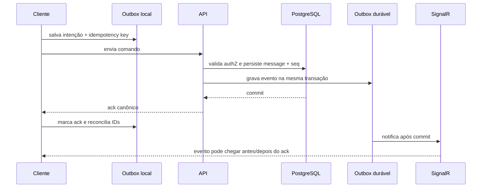

# Protocolo de Mensagens, Realtime e Sincronização

Contrato canônico de convergência para web, PWA, desktop e mobile. SignalR reduz
latência; PostgreSQL e APIs de histórico/sync preservam durabilidade.

## Invariantes

1. Confirmação de sucesso só ocorre após persistência durável.
2. `seq` define ordem por Conversation; timestamp nunca desempata mensagem.
3. Toda mutação retryable possui idempotency key estável.
4. Realtime é notificação best-effort, nunca fonte de verdade.
5. Reconnect sempre pode reconciliar por API.
6. Revogação e tombstone prevalecem sobre cache local.
7. Cliente antigo falha fechado quando a versão do protocolo é incompatível.

## Identificadores

| Campo | Responsabilidade |
|-------|------------------|
| `client_message_id` | UUID local para reconciliar UI otimista |
| `idempotency_key` | Deduplicar uma intenção lógica e seus retries |
| `message_id` | ID canônico atribuído/aceito pelo servidor |
| `conversation_id` | Escopo de ordenação |
| `seq` | Ordem monotônica dentro da Conversation |
| `event_id` | Deduplicar envelope recebido |
| `cursor` | Posição opaca de sincronização |
| `version` | Concorrência de entidade editável |
| `correlation_id` | Rastrear operação ponta a ponta |

`client_message_id` não substitui idempotency key. O primeiro reconcilia a UI; a
segunda protege o efeito no servidor.

## Envio online

O cliente deduplica ack/evento por `message_id`, `client_message_id` e
`event_id`, sem renderizar duas mensagens.

## Outbox local

Cada item contém:

- conta/tenant/workspace;
- tipo de comando;
- payload mínimo;
- idempotency key;
- client ID;
- dependências locais;
- tentativa e próximo retry;
- estado `Queued | Sending | Acked | Conflict | Failed | Cancelled`;
- versão do protocolo.

Regras:

- fila é separada por conta e tenant;
- logout/revogação remove conteúdo e chaves;
- retry usa backoff com jitter e limite;
- erro de authZ/schema não é retry infinito;
- anexo precisa concluir/reconciliar antes da mensagem dependente;
- cliente nunca altera a idempotency key ao repetir a mesma intenção.

## Ack e estados

| Estado local | Significado |
|--------------|-------------|
| Pending | Persistido apenas localmente |
| Sending | Request em andamento |
| Sent | Servidor confirmou durabilidade e retornou identidade/seq |
| Conflict | Servidor rejeitou versão; ação humana ou regra explícita |
| Failed | Erro terminal com mensagem recuperável |

Receber SignalR não promove `Pending` para `Sent` sem correspondência inequívoca.

## Cursor e sincronização incremental

O endpoint de sync retorna:

- versão do protocolo;
- server time;
- novo cursor opaco;
- mudanças ordenadas;
- tombstones/revogações;
- `has_more`;
- motivo de rebuild quando cursor expirou.

Cursor:

- é por principal/dispositivo/escopo definido no ADR;
- não contém autorização confiável enviada pelo cliente;
- pode expirar após compactação;
- avança somente depois de aplicar o lote localmente;
- não pode permitir enumerar outro tenant.

Para histórico de conversa, `seq` continua sendo a ordenação canônica. Cursor de
sync pode abranger múltiplos tipos e não substitui `seq`.

## Detecção de lacuna

Ao receber evento com `seq > last_contiguous_seq + 1`:

1. marcar conversation como `CatchingUp`;
2. buscar intervalo ausente;
3. deduplicar itens já recebidos;
4. aplicar em ordem de `seq`;
5. só então avançar `last_contiguous_seq`;
6. repetir até não existir gap.

Evento atrasado com `seq` já aplicado é ignorado de forma idempotente.

## Reconnect

1. renovar/validar token;
2. restabelecer tenant/account;
3. iniciar sync incremental antes de considerar conexão saudável;
4. reentrar apenas em grupos ainda autorizados;
5. reenviar comandos pendentes;
6. reconciliar gaps;
7. liberar UI de `Reconnecting` para `Online`.

SignalR reconectado sem sync não significa convergência.

## Edição e conflito

- Update envia `expected_version`/ETag.
- Servidor aceita exatamente a versão esperada.
- Conflito retorna versão atual e reason code.
- Política automática só pode existir para operação com merge seguro.
- Edição de body concorrente não usa last-write-wins silencioso.
- Histórico registra versão e ator conforme B-114.

## Delete e tombstone

Tombstone mínimo informa:

- tipo/ID;
- versão ou `seq`;
- deleted/revoked at;
- reason class sem dado sensível;
- cursor de aplicação.

Tombstone remove conteúdo e derivados locais. Não ressuscitar item porque uma
operação offline antiga chegou depois. Legal hold pode preservar no servidor sem
autorizar exibição ao cliente.

## Cursor inválido e rebuild

Servidor retorna reason code estável:

- `CursorExpired`;
- `ProtocolUpgradeRequired`;
- `ScopeRevoked`;
- `FullResyncRequired`.

Rebuild:

1. preserva comandos locais ainda não enviados em área isolada;
2. limpa read models do escopo;
3. baixa snapshot autorizado;
4. aplica delta posterior;
5. revalida comandos preservados;
6. descarta de forma explicável os agora proibidos.

## Compactação e expiração local

- cache possui limite por tamanho, idade e número de conversations;
- itens pending/conflict não são podados silenciosamente;
- conteúdo revogado tem prioridade de remoção;
- anexos usam lifecycle separado;
- índice local é reconstruível;
- versão de schema local tem migration ou rebuild seguro.

## SignalR

Eventos duráveis carregam identidade suficiente para fetch/reconcile, mas não
precisam carregar body completo. Presence e typing são efêmeros e não entram no
sync durável.

Clientes lentos:

- possuem buffer limitado;
- recebem indicação de resync quando o buffer estoura;
- nunca forçam retenção ilimitada no servidor;
- não bloqueiam fan-out para outros clientes.

## Segurança

- sync revalida authZ atual em cada leitura;
- cursor é opaco e tenant-scoped;
- cache e chaves são separados por conta;
- push não contém body sensível por default;
- logs não guardam payload local, token ou ciphertext key;
- remote logout/revoke agenda limpeza imediata;
- dispositivo offline deixa de receber futuro e é limpo no próximo contato.

## Compatibilidade

Mudança additive preserva clientes suportados. Breaking change exige:

- nova versão negociada;
- janela de compatibilidade;
- migration/rebuild local;
- bloqueio claro para cliente incompatível;
- rollout e rollback.

## Sinais

- ack latency;
- realtime delivery latency;
- reconnect duration;
- gap count e gap-fill duration;
- duplicate prevented;
- out-of-order received;
- sync lag;
- cursor invalidation;
- pending age;
- conflict rate;
- revoked data cleanup lag.

## Testes

- ack antes/depois do evento SignalR;
- retry após timeout de resposta sem duplicar;
- eventos duplicados, atrasados e fora de ordem;
- gap de uma e muitas páginas;
- reconnect durante envio;
- cursor expirado e rebuild;
- edição concorrente;
- delete/revoke contra operação offline;
- troca de tenant/conta;
- mixed client versions;
- cliente lento e buffer excedido;
- caos de rede em duas sessões.
