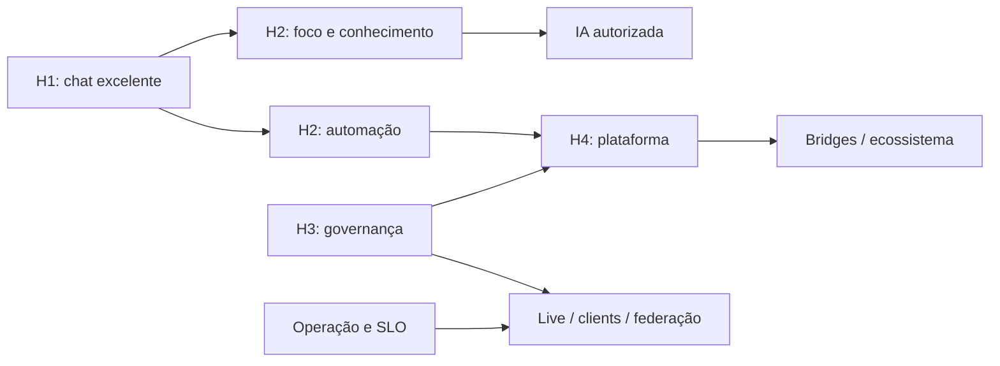

# Mapa de Capacidades — VibeChat

Mapa de produto para evitar features isoladas e mostrar como a ambição se
organiza. Estados:

- **Atual:** existe no snapshot de 2026-07-27;
- **Committed:** Waves 7–10, próximas na fila;
- **Planned:** Waves 11–17 autorizadas, com spec e ordem;
- **Later:** ideia não promovida, sem compromisso de execução.

## Comunicação

| Capacidade | Estado | Próximo passo |
|------------|--------|---------------|
| Channels, spaces, DM 1:1, threads | Atual | Qualidade contínua |
| Grupos na lista de contatos (departamentos + pessoais) | Planned | B-166 / W11 |
| Timeline rica, menções, anexos múltiplos, áudio, vídeo curto | Committed | Waves 8–9 |
| Message bubble moderno (layout tipado + ações + preview) | Done | B-163 / W9-0 |
| Editar mensagem no composer (não inline na bolha) | Committed | B-173 / W9-10 |
| Políticas de edição/apagar (janela, papéis) | Committed | B-107 / W10-11 |
| Não lidas, notificações, DM em grupo, guests | Committed | Waves 9–10 |
| Anúncios e canais somente leitura | Planned | B-112 / W11 |
| Agendar mensagem e lembrete | Planned | B-113 / W11 |
| Histórico de edição/movimentação | Planned | B-114 / W11 |
| Migração/importação assistida | Planned | B-153 / W11 |
| Inbox unificada e prioridade | Planned | B-117 / W11 |
| Tópicos/fórum como modo de canal | Planned | B-118 / W11 |
| Voz/vídeo/screen share | Planned | B-147/B-148 / W17 |

## Conhecimento e foco

| Capacidade | Estado | Próximo passo |
|------------|--------|---------------|
| Busca FTS e resumo opcional | Atual | Filtros em B-098 |
| Salvos, pins e seguir thread | Committed | Waves 9–10 |
| Painéis de contexto (sidebar direita) | Planned | B-171 / W9-9 |
| Barra de navegação (sidebar esquerda) | Planned | B-184 / W9-11 |
| Decisões e action items vinculados | Planned | B-119 / W12 |
| Digests e catch-up programado | Planned | B-122 / W12 |
| Busca semântica/RAG autorizada | Planned | B-121 / W12 |
| Base de conhecimento leve | Planned | B-120 / W12 |
| Canvas/edição colaborativa CRDT | Planned | B-152 / W17 |

## Automação e trabalho

| Capacidade | Estado | Próximo passo |
|------------|--------|---------------|
| Webhook outbound mínimo | Atual | B-108 |
| Bot/token e plugins locais | Committed | B-109/B-110 |
| Tarefas derivadas de mensagens | Planned | B-123 / W12 |
| Formulários e aprovações | Planned | B-124 / W12 |
| Automation builder | Planned | B-125 / W13 |
| Incident rooms e playbooks | Planned | B-126 / W13 |
| Conectores bidirecionais | Planned | B-127 / W13 |

## Administração, segurança e compliance

| Capacidade | Estado | Próximo passo |
|------------|--------|---------------|
| Papéis, audit, export, retenção | Atual | Hardening contínuo |
| Backup de chat (tarefas + destinos) | Planned | B-172 / W16 |
| Guests restritos e políticas de edição | Committed | Wave 10 |
| SCIM e sincronização de grupos | Planned | B-128 / W13 |
| Legal hold e eDiscovery | Planned | B-129 / W14 |
| Modo auditoria de conteúdo (gate E2EE) | Planned | B-169 / W14 |
| Classificação e DLP | Planned | B-130 / W14 |
| Malware scanning/quarentena | Planned | B-131 / W13 |
| Export de audit para SIEM | Planned | B-132 / W14 |
| Policy packs e admin delegado | Planned | B-133/B-134 / W14 |
| E2EE | Planned | B-064 / W16 (deps B-169) |
| Diagnóstico e support bundle sanitizado | Planned | B-154 / W11 |

## Plataforma e ecossistema

| Capacidade | Estado | Próximo passo |
|------------|--------|---------------|
| Outbox, APIs internas e observabilidade | Atual | Versionar contratos |
| Webhooks estendidos e núcleo de plugins | Committed | Wave 10 |
| Capabilities avançadas de plugins | Planned | B-066/B-111 / W15 |
| Developer portal e credenciais de integração | Planned | B-135 / W15 |
| SDK e kit de teste de plugins | Planned | B-136 / W15 |
| Registry assinado e governado | Planned | B-137 / W15 |
| Bridge framework | Planned | B-138 / W15 |
| Schema registry de eventos | Planned | B-139 / W13 |
| White-label governado | Planned | B-140 / W15 |

## Clientes e operação em escala

| Capacidade | Estado | Próximo passo |
|------------|--------|---------------|
| Web/PWA e Compose | Atual | Waves 7–10 |
| Desktop empacotado | Planned | B-141 / W15 |
| Mobile nativo | Planned | B-063 / W15 |
| Offline sync real | Planned | B-143 / W16 |
| HA e rolling upgrade | Planned | B-144 / W16 |
| Lifecycle de storage/CDN | Planned | B-145 / W16 |
| Backup de chat (tarefas + destinos remotos) | Planned | B-172 / W16 |
| Benchmarks e SLOs por porte | Planned | B-146 / W14 |
| Revisão de performance e escalabilidade | Planned | B-170 / W16 |
| Federação entre instâncias | Planned | B-065 / W16 |

## Delight e identidade

| Capacidade | Estado | Próximo passo |
|------------|--------|---------------|
| Light/dark, marca e sons | Atual | Preservar tokens |
| Emoji/reactions livres e a11y | Committed | Waves 8–10 |
| Status personalizado e agenda | Planned | B-116 / W11 |
| Emojis/stickers da organização | Later | Reavaliar depois de B-083 |
| Perfis ricos (cargo, sobre, destaque, avatar) | Planned | B-167 / W11 |
| Personalização visual (wallpaper/accent) | Planned | B-185 / W11 |
| Diretório de expertise / skills | Later | Reavaliar depois de B-167 e B-128 |
| Temas/branding por tenant | Planned | B-140 / W15 |

## Dependências estruturais

As setas representam dependências conceituais. Para itens `Planned`, a ordem
executável e as dependências canônicas estão em `horizonte-ambicioso.md`.
